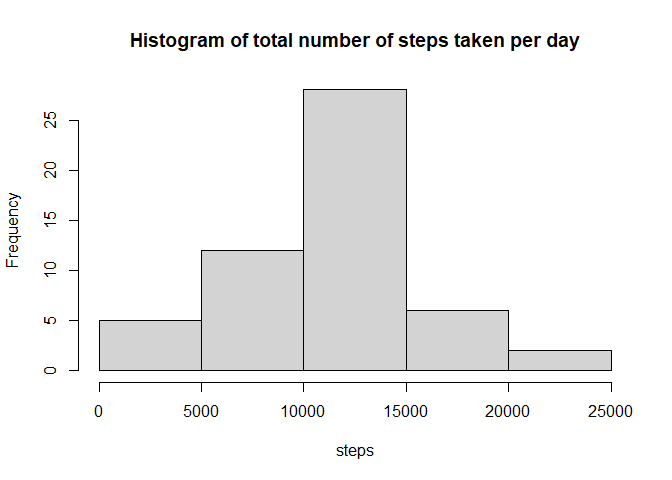
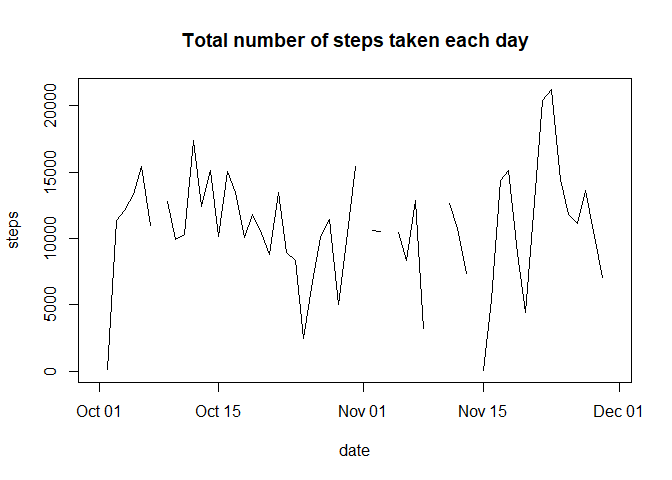
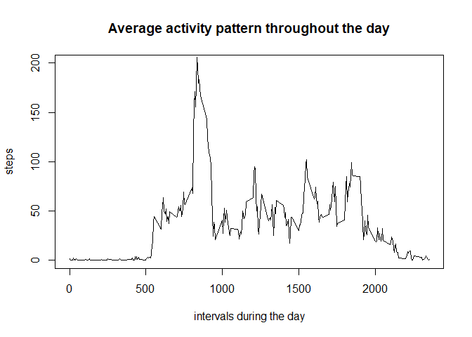
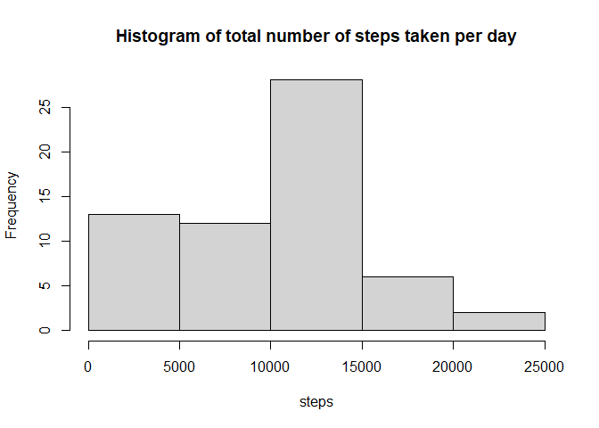
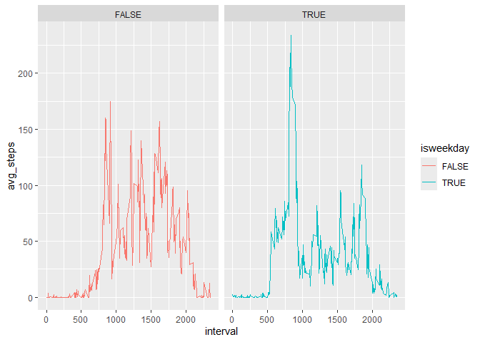

## Loading and preprocessing the data

``` r
activity <- read.csv("activity.csv")
activity$date <- as.POSIXct(activity$date)
head(activity)
```

```
##   steps       date interval
## 1    NA 2012-10-01        0
## 2    NA 2012-10-01        5
## 3    NA 2012-10-01       10
## 4    NA 2012-10-01       15
## 5    NA 2012-10-01       20
## 6    NA 2012-10-01       25
```

Let's see how big the dataset is:

``` r
dim(activity)
```

```
## [1] 17568     3
```


## What is mean total number of steps taken per day?
We will use *tapply* funciton to calculate that:


``` r
tbl <- tapply(activity$steps, activity$date, sum)
tbl <- as.data.frame(tbl)
tbl$date <- as.POSIXct(row.names(tbl))

mean(tbl$tbl, na.rm=TRUE)
```

```
## [1] 10766.19
```
So the mean total number of steps taken per day equals *10766.19*.

## What is median total number of steps taken per day?

``` r
median(tbl$tbl, na.rm=TRUE)
```

```
## [1] 10765
```

So the median total number of steps taken per day equals *10765*.

Histogram of the total number of steps taken each day:

``` r
hist(tbl$tbl,xlab="steps", main="Histogram of total number of steps taken per day")
```

<!-- -->

We can also visualize total number of steps taken each day on a graph:

``` r
par(mfrow=c(1,1))
plot(x= tbl$date, y=tbl$tbl, type="l", xlab="date", ylab="steps", main="Total number of steps taken each day")
```

<!-- -->


## What is the average daily activity pattern?
Here we can also use *tapply* function to calculate mean of steps taken within intervals:


``` r
tbl <- tapply(activity$steps, activity$interval, mean, na.rm=TRUE)
tbl <- as.data.frame(tbl)
tbl$interval <- row.names(tbl)

par(mfrow=c(1,1))
plot(x= tbl$interval, y=tbl$tbl, ylim=c(0,200), type="l", xlab="intervals during the day", ylab="steps", main="Average activity pattern throughout the day")
```

<!-- -->

The 5-minute interval that, on average, contains the maximum number of steps:


``` r
avgstep <- as.data.frame(tapply(activity$steps, activity$interval, mean, na.rm=TRUE))
names(avgstep) = c("avg_steps")
avgstep$interval <- as.integer(row.names(avgstep))
avgstep[avgstep$avg_steps == max(avgstep$avg_steps), ]
```

```
##     avg_steps interval
## 835  206.1698      835
```
 
 
## Imputing missing values
Let's see how many missing values in the dataset:


``` r
summary(activity$steps)
```

```
##    Min. 1st Qu.  Median    Mean 3rd Qu.    Max.    NA's 
##    0.00    0.00    0.00   37.38   12.00  806.00    2304
```
So there's total of *2304* missing values in the dataset.
Total number of rows in the dataset is: *17568* as we have identified earlier.


``` r
2304/17568
```

```
## [1] 0.1311475
```
So there's approximately *13%* missing values.


There's several approaches to imputing the missing values, some of them are - use mean, median or mode.

Here I will use daily median value for imputing missing values within a specific day. I will copy *activity* dataset and impute missing values into copied object.


``` r
activity1 <- data.frame(activity)
nas <- which(is.na(activity1$steps))

for (i in nas) {
    needed_date <- activity$date[i]
    date_subset <- subset(activity, date == needed_date,
                          select=c(steps))
    median_day <- median(date_subset$steps, na.rm=TRUE)
    activity1$steps[i] <- if(is.na(median_day)) 0 else median_day
}
```


``` r
tbl <- tapply(activity1$steps, activity1$date, sum)
tbl <- as.data.frame(tbl)
tbl$date <- as.POSIXct(row.names(tbl))

mean(tbl$tbl, na.rm=TRUE)
```

```
## [1] 9354.23
```
So the mean total number of steps taken per day equals *9354.23*.


## What is median total number of steps taken per day?

``` r
median(tbl$tbl, na.rm=TRUE)
```

```
## [1] 10395
```

So the median total number of steps taken per day equals *10395*.


Now let's see whether the histogram of the total number of steps taken each day has changed after missing values were imputed  


``` r
hist(tbl$tbl,xlab="steps", main="Histogram of total number of steps taken per day")
```

<!-- -->

As we can see, the mean and median vallues have been slightly changed after imputing. Also the histogram slightly changed, because the missing values were imputed.


## Are there differences in activity patterns between weekdays and weekends?

``` r
library(ggplot2)

activity$isweekday <- as.POSIXlt(activity$date)$wday != 6 & as.POSIXlt(activity$date)$wday != 0

weekdays <- subset(activity, activity$isweekday == TRUE)
weekends <- subset(activity, activity$isweekday == FALSE)

avgstep1 <- as.data.frame(tapply(weekdays$steps, weekdays$interval, mean, na.rm=TRUE))
avgstep2 <- as.data.frame(tapply(weekends$steps, weekends$interval, mean, na.rm=TRUE))

names(avgstep1) = c("avg_steps")
avgstep1$interval <- as.integer(row.names(avgstep1))
avgstep1$isweekday <- TRUE

names(avgstep2) = c("avg_steps")
avgstep2$interval <- as.integer(row.names(avgstep2))
avgstep2$isweekday <- FALSE

avgstep <- rbind(avgstep1, avgstep2)

ggplot(avgstep , aes(x = interval, y = avg_steps, color = isweekday)) +
   geom_line(show.legend = TRUE) +
   facet_wrap(~isweekday)
```

<!-- -->

